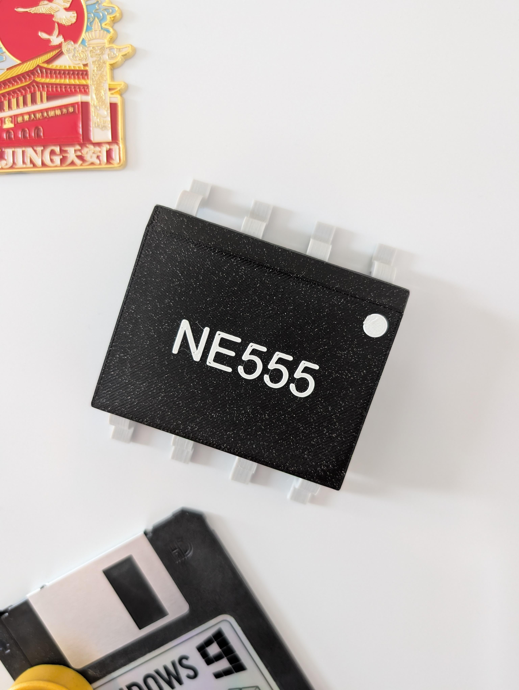

# NE555-Fridge-Magnet

This project brings the legendary NE555 timer IC to life in a fun, oversized 3D-printed format. As a fully modular snap-fit kit, it’s designed to be assembled without soldering and proudly displayed as a fridge magnet or maker-space decoration. Whether you're a seasoned electronics geek or just love cool desk toys – this one’s for you!

Get Your Kit Today at [Blinkyparts](https://shop.blinkyparts.com/de/NE555-Kuehlschrankmagnet-Fuer-echte-Nerds-Elektronikfans/blink23141)

A detailed **step-by-step guide** is available in the Wiki and GitHub repository.

## License
This project is licensed under **CC-BY-SA 4.0** - Mario Langhammer and Timo Schindler
